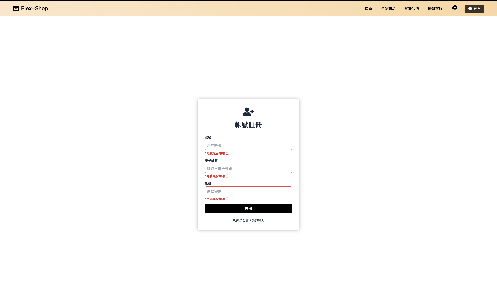
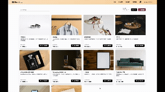
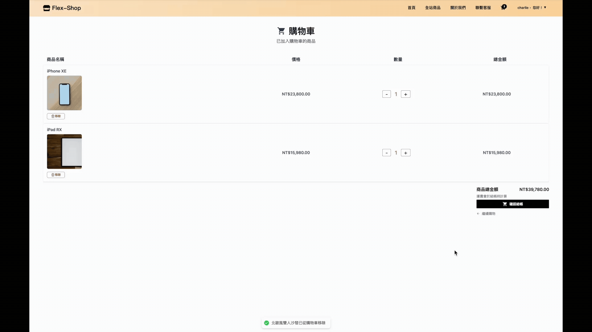
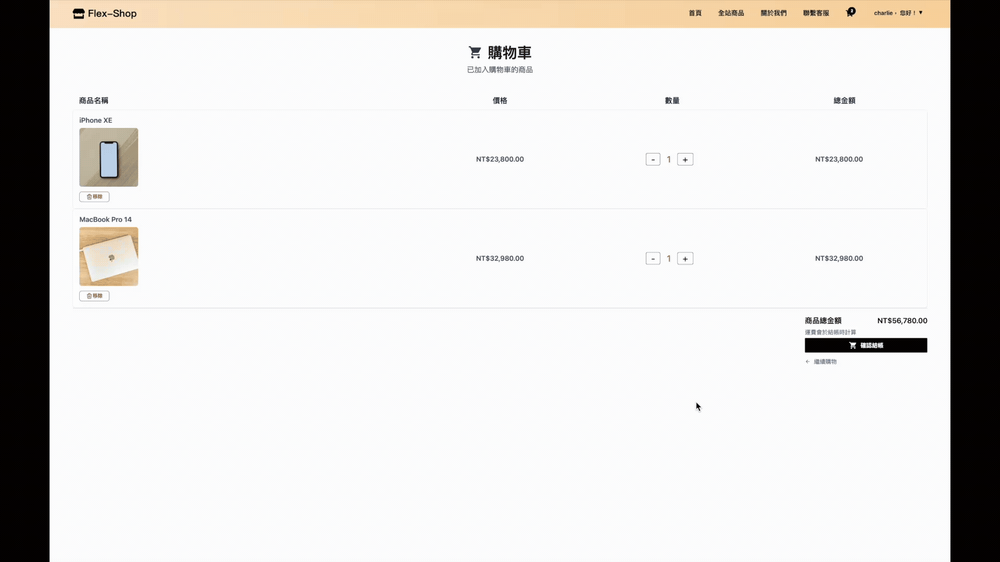
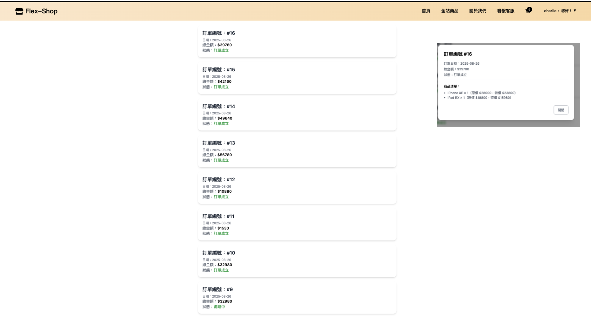

# 電商平台（E-commerce System）

# 系統介紹
本專案為模擬 線上購物商城 的練習專案，採用 前後端分離架構：
- 前端：以 React.js + Tailwind CSS 開發，提供使用者網購操作體驗。
- 後端：以 Spring Boot + MySQL 建立 RESTful API，並支援 JWT 驗證與授權。
- 支付串接：支援 Line Pay 與 Stripe，模擬完整線上購物付款流程。
- 本檔案為 **前端原始碼**，後端原始碼請見：[E-commerce | 後端原始碼](https://github.com/felixven/ecommerce-backend.git)

# 功能介紹
- 使用者驗證：註冊、登入、登出，並支援表單驗證密碼、Email格式、重複帳號。
- 商品瀏覽：瀏覽商品圖片、介紹，也可按商品類型篩選、分類和排序商品。
- 購物車：加入商品、調整數量、刪除商品。
- 結帳流程：完成商品選購、填寫地址，可選擇LinePay或Stripe付款。
- 訂單查詢：查詢歷史訂單狀態。

# 系統展示

**Demo網址**  
- https://ecommerce-frontend-ylwz.vercel.app/

**測試帳號 / 密碼**
<br>
- 可使用以下資料登入網頁，請輸入 **帳號或電郵** 和密碼。  
- 也歡迎註冊新帳密進行登入。

|帳號      |電郵                   |密碼        |
|-------- |--------------------- |------------|
| user1   |user1@example.com     |password1   |
| guest1  |guest1@gmail.com      |guest1   |

-此專案使用 Line Pay Sandbox 模擬付款流程，無實際金流。
-Stripe付款：
   -卡號：4242 4242 4242 4242
   -卡片到期日需晚於當前日期（例如 12/34），驗證碼可輸入任意 3 碼

### 會員註冊/登入
表單填寫具驗證功能

<br/>

### 商品加入購物車、購物車內容修改
可於首頁瀏覽及選購部分商品，也可進入商品頁面瀏覽或使用商品類型篩選商品，購物車內可修改商品數量

<br/>

### 商品類型篩選器
篩選器可按商品類型瀏覽商品，亦可套入排序條件

<br/>

### 填寫訂單收件地址、更新地址、刪除地址

<br/>

### 訂單結帳-Line Pay

<br/>

### 訂單結帳-Stripe

<br/>

### 訂單查詢

<br/><br/>

# 建構技術
- Vite
- React.js
- Tailwind.css

# 本機安裝
1. 取得原始碼  
   ```bash
   git clone https://github.com/felixven/ecommerce-frontend.git
   cd ecommerce-frontend
   ```
2. 安裝套件
   ```bash
   npm install
   ```
3. 設定環境變數，在專案根目錄找到 `.env` 檔案，加入以下內容：
   ```env
   # 後端端點（必填）
   VITE_BACK_END_URL=http://localhost:8080

   # 前端端點（可選，預設 http://localhost:5173）
   VITE_FRONT_END_URL=http://localhost:5173
   ```
4. 啟動伺服器
   ```bash
   npm run dev
   ```
5. 搭配後端測試
   - 請先完成安裝 [後端原始碼](https://github.com/felixven/ecommerce-backend#本機安裝與使用)。
   - 後端 application.properties 設定：
   ```properties
   frontend.url=${FRONTEND_URL}
   ```
   - 確保前後端 API 可以正確串接。


